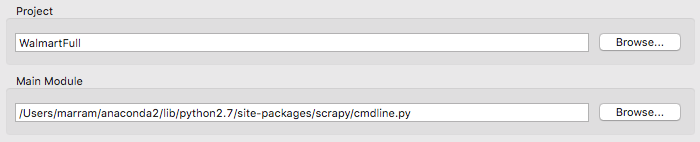
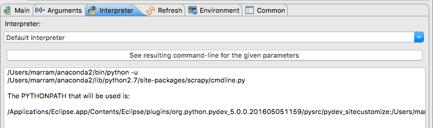
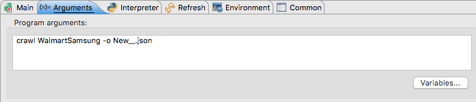

# Scrapy

Prerequisties :
  1. Python 2.7
  2. Latest version of pip

Installation :
  pip install scrapy

Setting up In Eclipse :
  1. Need to have pydev plugin for eclipse
  2. Set Interpreter to existing python.
  3. From outside create a new scrapy project using terminal ( scrapy startproject tutorial )
  4. Import that folder structure into eclipse

Project configurations in eclipse :
  1. Go to Run Configurations, Set the project as : Project name
  2. Set main module to scrapy/cmdline.py
  

  3. Then set the interpreter to default in run configurations, and check with see resulting command line for the given parameters.
  

  4. And add the aruments as below with spider name
  